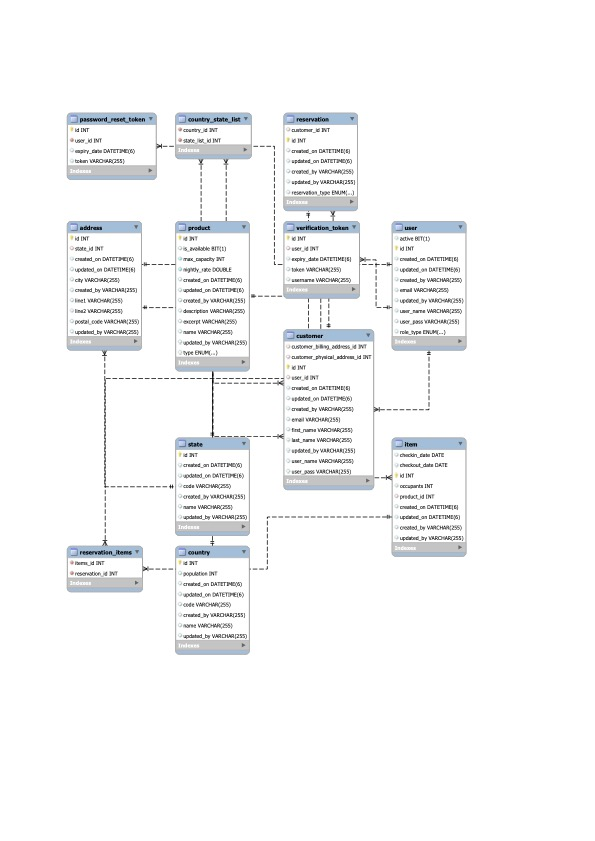

```markdown
# Application Configuration

This guide explains how to set up the `application.yml` file for your Spring Boot application.

## Database Configuration

The `spring.datasource` properties are used to configure the database connection:

```yaml
spring:
  datasource:
    url: jdbc:mysql://localhost:3306/db_name?useSSL=false&serverTimezone=UTC
    username: <your-database-username>
    password: <your-database-password>
    driver-class-name: com.mysql.cj.jdbc.Driver
    hikari:
      connection-timeout: 30000
      maximum-pool-size: 5
```

Replace `<your-database-username>` and `<your-database-password>` with your actual database username and password.

The `url` property specifies the JDBC URL for your database. In this case, it's configured to connect to a MySQL database named `final_project_ea` running on `localhost` on port `3306`.

The `driver-class-name` property specifies the JDBC driver class name. For MySQL, it's `com.mysql.cj.jdbc.Driver`.

The `hikari` properties are used to configure HikariCP, which is a fast and lightweight JDBC connection pool. The `connection-timeout` property specifies the maximum number of milliseconds that a client will wait for a connection from the pool. The `maximum-pool-size` property specifies the maximum size that the pool is allowed to reach.

## JPA Configuration

The `spring.jpa` properties are used to configure JPA:

```yaml
spring:
  jpa:
    hibernate:
      ddl-auto: update
    show-sql: true
    properties:
      hibernate:
        dialect: org.hibernate.dialect.MySQL8Dialect
```

The `ddl-auto` property is used to automatically create, update, or validate the database schema. In this case, it's set to `update`, which means Hibernate will automatically create and update the database schema.

The `show-sql` property is used to enable logging of SQL statements.

The `dialect` property is used to specify the SQL dialect that Hibernate should use. In this case, it's set to `org.hibernate.dialect.MySQL8Dialect`, which is the dialect for MySQL 8.

## OAuth2 Configuration

The `spring.security.oauth2` properties are used to configure OAuth2:

```yaml
spring:
  security:
    oauth2:
      client:
        registration:
          [...]
        provider:
          google:
```

The `registration` properties are used to configure the OAuth2 clients. You should replace `[...]` with the actual client configurations.

The `provider` properties are used to configure the OAuth2 providers. In this case, it's configured to use Google as the OAuth2 provider.

# UML Diagrams 
* Path: src/resources/UML Class Diagram.jpg

: 
```markdown
